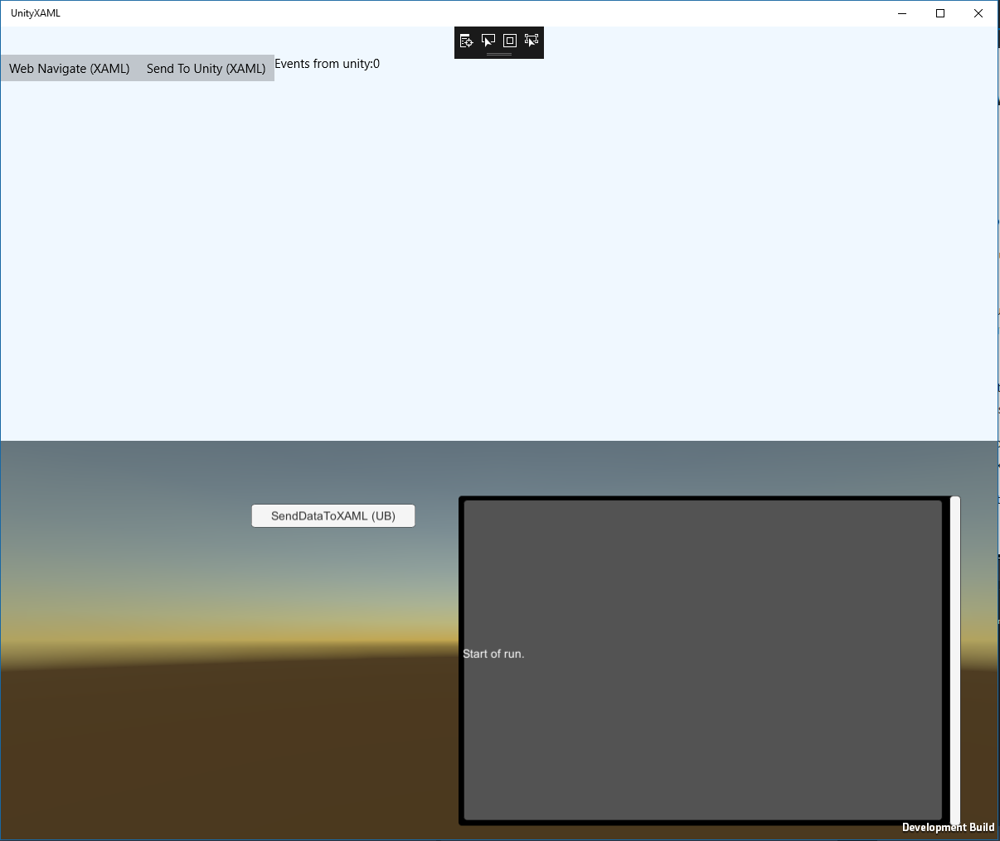
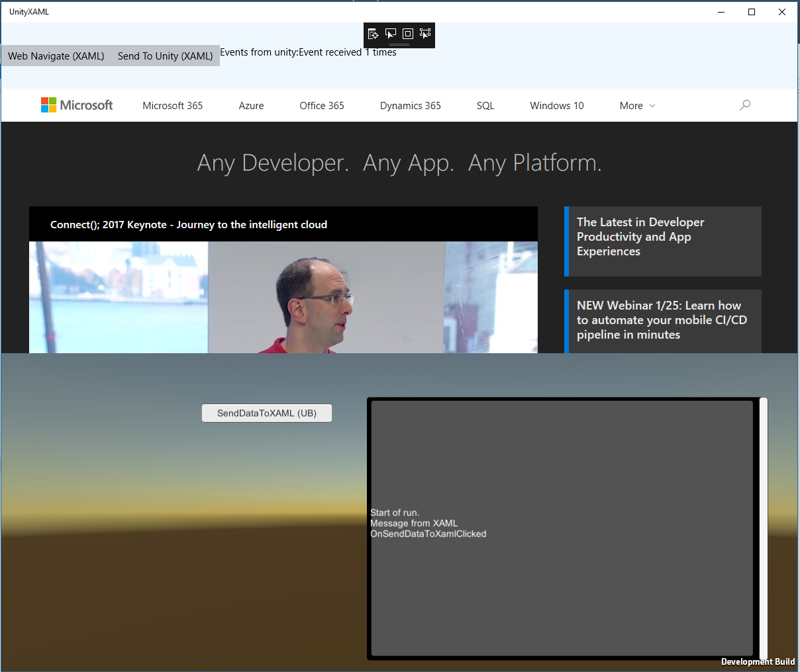

# UnityXAML
Unity sample project showing a XAML webview and interaction with a Unity application

# Contributing

This project welcomes contributions and suggestions.  Most contributions require you to agree to a
Contributor License Agreement (CLA) declaring that you have the right to, and actually do, grant us
the rights to use your contribution. For details, visit https://cla.microsoft.com.

When you submit a pull request, a CLA-bot will automatically determine whether you need to provide
a CLA and decorate the PR appropriately (e.g., label, comment). Simply follow the instructions
provided by the bot. You will only need to do this once across all repos using our CLA.

This project has adopted the [Microsoft Open Source Code of Conduct](https://opensource.microsoft.com/codeofconduct/).
For more information see the [Code of Conduct FAQ](https://opensource.microsoft.com/codeofconduct/faq/) or
contact [opencode@microsoft.com](mailto:opencode@microsoft.com) with any additional questions or comments.

*Following documentation only tells you how to build the project*

## Requirements
Minimum MSVS 2017
Minimum Unity 2017.3.x

The Unity sample project can be found in the UWPXaml directory.  Open Unity 2017 and open the project "On Disk"

## UnityXAML

The unity sample project.

## UnityXAML\Build
This directory contains some files which will be overlayed with a Unity generated XAML project.

# Build Instructions
Open the project in Unity by selecting the root folder of this cloned repo locally from the file->open project menu dialogs.

NOTE: You might get a dialog saying there is a Missing Project ID so you can't use Unity Services.  Select "Yes" and continue.

Under the Assets folder in project pane, open the 'MainScene' in _Scenes folder.
From Unity, choose File->Build Settings to bring up the Build Settings window. 
Click Add open scenes to in build section, it should be checked. 

### Choose Universal Windows Platform as the Platform. 
Then under the options

+ Choose "any device" as the Target device.

+ XAML as the UWP Build Type

+ Latest Installed as the SDK

+ Check "Unity C# Projects"

+ Then click Build. 

+ Select the folder called 'UWP' and choose this folder.

+ Wait for successful build.

### Open the UnityXAML\UWP\UnityXAML.sln in MSVC 2017 or higher.
  Select Debug|Release and x64|x32|Any CPU (depending on your VS configuration)
* Visual Studio 2017 is required to build this project

Once you have opened the solution you can Build->Solution and then run the sample.  

NOTE: If you get an option "Attach to unity" you have opened the incorrect SLN file.  Ensure you open the UnityXAML\UWP\UnityXAML.sln and not UnityXaml\UnityXAML.sln

The sample is composed of two parts, the XAML portion and the unity portion with a communication class used to pass information between them.

When you start the application you should get a split screen view.

#### The upper portion is controlled by the mainpage.xaml and contain:
* Two buttons
* A text block
* And a web view
#### The lower is the unity scene, which contains:
* One button 
* And a view used to show results.

Pressing "Web Navigate XAML" cause the XAML web view to navigate to a web page.
Pressing "Send To Unity (XAML)" will cause the feedback view to show a new message.
Pressing "SendDataToXAML (UB)" will cause a message to be sent to the xaml portion showing a count of events from Unity.

Starting

After use

